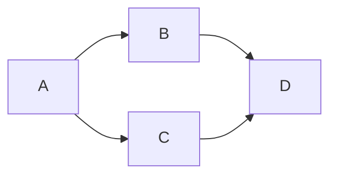

# BoxesPlus - 混合演示文稿生成器

> 用 Mermaid 创建图表 → 导出 PDF/PPTX

## 核心理念

```
数据定义 → Mermaid HTML → puppeteer → PDF/PPTX
```

## 快速开始

```bash
cd boxesplus
coffee Demo/demo-hybrid-v2.coffee
```

## 工作流

```
定义课程数据 → generate() → HTML + PDF + PPTX
```

## 使用示例

```coffee
{ CourseGenerator, generate, CHARTS } = require "./api/hybrid-generator.coffee"

课程 = new CourseGenerator("医疗质量与安全管理")

课程
  .addTitle("标题", "副标题")
  .addMermaid("PDCA循环", CHARTS.pdca)
  .addMermaid("不良事件闭环", CHARTS.eventLoop, "0.9")
  .addList("目标", ["掌握质量管理", "熟悉管理工具"])

await generate(课程, "output-name")
```

## 图表模板 (LR布局优化)

```coffee
CHARTS.pdca           # PDCA循环
CHARTS.pareto         # 饼图
CHARTS.qualitySystem  # 质量管理体系
CHARTS.eventLoop      # 事件闭环
CHARTS.dataLifecycle  # 数据生命周期
CHARTS.brandPyramid  # 品牌金字塔
CHARTS.patientSafety  # 患者安全目标
CHARTS.swot           # SWOT分析
CHARTS.surgery        # 围手术期
CHARTS.evaluation     # 学科评估
```

## 缩放参数

```coffee
.addMermaid("标题", chart)        # 默认 1.0
.addMermaid("标题", chart, "0.9") # 缩小10%
.addMermaid("标题", chart, "1.2") # 放大20%
```

## 手动导出

```coffee
{ generateHtml, htmlToPdf, htmlToPptx } = require "./api/hybrid-generator.coffee"

generateHtml(data, "output.html")
htmlToPdf("input.html", "output.pdf")
htmlToPptx("input.html", "output.pptx")
```

## 核心技巧

### 1. 纵横交换 (最重要!)
```mermaid
# 高瘦图 (问题)
flowchart TD
    A --> B --> C

# 宽矮图 (解决)
flowchart LR
    A --> B --> C
```

### 2. 对角线布局


### 3. 简化节点名
```mermaid
# 避免 (会显示代码)
flowchart TB
    A1[步骤1] --> B1[步骤2]
    B1 --> C1[步骤3]

# 使用 (推荐)
flowchart TB
    步骤一 --> 步骤二
    步骤二 --> 步骤三
```

## 文件

| 文件 | 说明 |
|------|------|
| `api/hybrid-generator.coffee` | 核心生成器 |
| `Demo/demo-hybrid-v2.coffee` | 演示示例 |
| `outputs/hybrid-demo-v2.pdf` | 演示结果 |

## 演进历史

- **早期**: 直接 PptxGenJS 生成
- **中期**: Reveal.js + Mermaid (兼容问题)
- **当前**: 纯 HTML + Mermaid + puppeteer 导出

## 整合来源

- **AI朋友探索**: 纵横交换技巧、混合生成器
- **我们的实践**: puppeteer 渲染、PDF/PPTX导出
