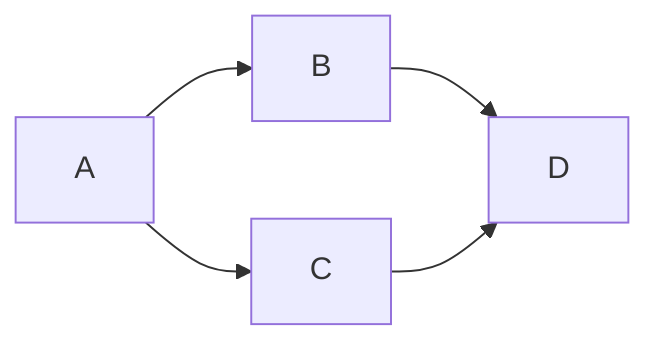

# BoxesPlus - 混合演示文稿生成器

> 用 Mermaid 创建图表 → 导出 PDF/PPTX

## 核心理念

```
数据定义 → Mermaid HTML → puppeteer → PDF/PPTX
```

## 快速开始

```bash
cd boxesplus
coffee Demo/demo-hybrid-v2.coffee
```

## 工作流

```
定义课程数据 → generate() → HTML + PDF + PPTX
```

## 使用示例

```coffee
{ CourseGenerator, generate, CHARTS } = require "./api/hybrid-generator.coffee"

课程 = new CourseGenerator("医疗质量与安全管理")

课程
  .addTitle("标题", "副标题")
  .addMermaid("PDCA循环", CHARTS.pdca)
  .addMermaid("不良事件闭环", CHARTS.eventLoop, "0.9")
  .addList("目标", ["掌握质量管理", "熟悉管理工具"])

await generate(课程, "output-name")
```

## 布局类型

```coffee
.addTitle("标题", "副标题")      # 标题页
.addMermaid("标题", chart)      # Mermaid 图表
.addList("标题", [items])       # 列表
.addTwoCol("标题", leftTitle, leftItems, rightTitle, rightItems)  # 双栏对比
.addImage("标题", imagePath)    # 图片
.addCode("标题", code, lang)    # 代码块
```

## 图表模板 (LR布局优化)

```coffee
CHARTS.pdca           # PDCA循环
CHARTS.pareto         # 饼图
CHARTS.qualitySystem  # 质量管理体系
CHARTS.eventLoop      # 事件闭环
CHARTS.dataLifecycle  # 数据生命周期
CHARTS.brandPyramid  # 品牌金字塔
CHARTS.patientSafety  # 患者安全目标
CHARTS.swot           # SWOT分析
CHARTS.surgery        # 围手术期
CHARTS.evaluation     # 学科评估
```

## 缩放参数

```coffee
.addMermaid("标题", chart)        # 默认 1.0
.addMermaid("标题", chart, "0.9") # 缩小10%
.addMermaid("标题", chart, "1.2") # 放大20%
```

## 高级 OO API

### 方式 1: 实例方式

```coffee
{ Slide, Section, Presentation, MermaidSlide, ListSlide, CHARTS } = require "./api/oo-api.coffee"

slide = new MermaidSlide("PDCA", CHARTS.pdca)
section = new Section("质量管理").add(slide)
presentation = new Presentation("课程").addSection(section)
await presentation.generate("output")
```

### 方式 2: 类继承 (Class-as-Slide 模式)

```coffee
# 继承创建自定义幻灯片
class QualityChart extends MermaidSlide
  @scale: "0.85"

class PdcaSlide extends QualityChart
  constructor: ->
    super("PDCA循环", CHARTS.pdca)

# 类侧定义章节
class QualitySection extends Section
  @title: "质量管理"
  constructor: ->
    super("质量管理")
    @add(new PdcaSlide())

# 类侧定义演示文稿
class CoursePresentation extends Presentation
  @title: "医疗质量课程"
  @sections: [QualitySection]

# 使用
课程 = new CoursePresentation()
await 课程.generate("output")
```

### 方式 3: 数据驱动

```coffee
class DataDrivenSection extends Section
  @createSlides: (dataArray) ->
    for data in dataArray
      new ListSlide(data.title, data.items)

数据 = [
  { title: "目标1", items: ["项A", "项B"] }
  { title: "目标2", items: ["项C", "项D"] }
]

章节 = new DataDrivenSection("数据章节", 数据)
```

### 核心类

| 类 | 说明 |
|---|---|
| `Slide` | 基类,所有幻灯片继承自此 |
| `MermaidSlide` | Mermaid 图表幻灯片 |
| `ListSlide` | 列表幻灯片 |
| `TwoColSlide` | 双栏对比幻灯片 |
| `Section` | 章节,包含多个幻灯片 |
| `Presentation` | 完整演示文稿 |

## 手动导出

```coffee
{ generateHtml, htmlToPdf, htmlToPptx } = require "./api/hybrid-generator.coffee"

generateHtml(data, "output.html")
htmlToPdf("input.html", "output.pdf")
htmlToPptx("input.html", "output.pptx")
```

## 核心技巧

### 1. 纵横交换 (最重要!)
```mermaid
# 高瘦图 (问题)
flowchart TD
    A --> B --> C

# 宽矮图 (解决)
flowchart LR
    A --> B --> C
```

### 2. 对角线布局


### 3. 简化节点名
```mermaid
# 避免 (会显示代码)
flowchart TB
    A1[步骤1] --> B1[步骤2]
    B1 --> C1[步骤3]

# 使用 (推荐)
flowchart TB
    步骤一 --> 步骤二
    步骤二 --> 步骤三
```

## 文件

| 文件 | 说明 |
|------|------|
| `api/hybrid-generator.coffee` | 核心生成器 |
| `api/oo-api.coffee` | OO API (Class-as-Slide) |
| `cli/boxesplus.coffee` | CLI 工具 |
| `Demo/demo-*.coffee` | 演示示例 |
| `outputs/` | 生成的文件 |
| `scripts/` | 工具脚本 |

## 项目结构

```
boxesplus/
├── api/                    # 核心 API
│   ├── hybrid-generator.coffee   # 主生成器
│   └── oo-api.coffee            # OO API
├── cli/                    # CLI 工具
│   └── boxesplus.coffee
├── Demo/                   # 演示文件
│   ├── demo-hybrid-v2.coffee
│   ├── demo-oo-api.coffee
│   └── demo-cso-fixed.coffee
├── outputs/                # 生成的文件
├── scripts/                # 工具脚本
│   └── serve.coffee        # 本地服务器
├── resources/              # 资源文件
├── Deprecated/              # 已废弃的文件
└── package.json
```

## 演进历史

- **早期**: 直接 PptxGenJS 生成
- **中期**: Reveal.js + Mermaid (兼容问题)
- **当前**: 纯 HTML + Mermaid + puppeteer 导出

## 整合来源

- **AI朋友探索**: 纵横交换技巧、混合生成器
- **我们的实践**: puppeteer 渲染、PDF/PPTX导出

## CLI 工具

```bash
# 监听文件变化自动生成
npm run watch

# 交互式创建
npm run interactive

# 一次性生成
npm run generate Demo/demo-hybrid-v2.coffee
```

## CoffeeScript 模式

### 1. 类名自动作为标题
```coffee
class PDCA循环 extends MermaidSlide
# @constructor.name → "PDCA循环"
```

### 2. @cso: @dataPrepare?() 模式
类定义时自动运行数据准备:
```coffee
class 章节 extends Section
  @dataPrepare: ->
    slides: [
      { type: MermaidSlide, title: "PDCA", chart: CHARTS.pdca }
    ]
  @cso: @dataPrepare?()
```

### 3. 双侧编程
- `@` (类侧) - 模板/共享配置
- `this` (实例侧) - 具体数据
