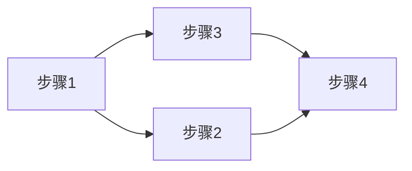

# Mermaid图表生成PDF/PPTX工作空间

## 📋 项目概述

本项目专注于将Mermaid图表生成PDF/PPTX的解决方案，重点解决"高瘦离谱"图表的问题。

## 🎯 核心秘籍：纵横交换

**问题**：某些Mermaid图表使用`flowchart TD`（Top-Down）布局时，会产生"高瘦离谱"的图表

**解决方案**：将`flowchart TD`改为`flowchart LR`（Left-Right）

**效果**：
- 宽而矮（宽高比 > 0.8）
- 适合宽屏幕（16:9）
- 缩放后保持好看

## 🖼️ 图片尺寸优化

**问题**：生成的图片太小（1200 x 61px），在PPTX中放大导致模糊

**解决方案**：使用CSS `transform: scale(2)`放大图片

**效果**：
- 图片尺寸从1200 x 61px提升到4696 x 166px
- 避免在PPTX中放大导致模糊
- 图片质量更高，更清晰

## 📂 目录结构

```
my-workspace/
├── README.md                    # 本文件
├── docs/                       # 文档目录
│   └── Mermaid图表生成PDF_PPTX方案.md  # 完整方案文档
├── demo/                       # 演示代码
│   ├── C01课程图表-简化测试版.coffee
│   ├── C01课程图表-一次成型版.coffee
│   ├── C01课程图表-优化版.coffee
│   ├── 方案1-Puppeteer截图.coffee
│   ├── 方案1-完整流程.coffee
│   ├── 方案1-简化版.coffee
│   ├── 测试一次成型尺寸.coffee
│   └── 测试优化版尺寸.coffee
├── deprecated/                  # 过时的代码
│   ├── C01课程图表-修复版.coffee
│   ├── C01课程图表-修复版v2.coffee
│   ├── C01课程图表-双侧编程版.coffee
│   ├── C01课程图表-完整版.coffee
│   ├── C01课程图表-数据驱动版.coffee
│   ├── C01课程图表-诗式版.coffee
│   ├── C01课程图表-PPTX-HTML版.coffee
│   ├── C01课程-混合生成演示.coffee
│   └── 对角线布局技巧演示.coffee
├── output/                     # 输出文件
│   ├── images/                  # 图表图片（T001系列）
│   ├── images-一次成型/          # 一次成型版图片
│   └── *.html                  # 生成的HTML文件
└── api/                        # API代码
    ├── hybrid-generator-v2.coffee
    ├── mermaid-enhanced-v3.coffee
    └── mermaid-to-pptx-html.coffee
```

## 📚 文档索引

### 主要文档
- [Mermaid图表生成PDF_PPTX方案.md](docs/Mermaid图表生成PDF_PPTX方案.md) - 完整的方案文档，包含：
  - 核心秘籍：纵横交换
  - 图片尺寸优化（CSS transform放大）
  - 实际测试结果
  - 完整工作流程
  - 其他技巧（对角线布局、改变图表类型等）

### 辅助文档
- [Mermaid用户友好API使用指南.md](docs/Mermaid用户友好API使用指南.md) - 用户友好API文档，包含：
  - 快速开始指南
  - 图表类型说明
  - 完整示例代码
  - 生成PPTX中的图片
  - API参考
- [工作空间整理说明.md](docs/工作空间整理说明.md) - 工作空间整理说明，包含：
  - 整理后的目录结构
  - 输出文件说明
  - 核心发现和测试结果

## 🚀 快速开始

### 用户友好API（推荐）

**特点**：
- ✅ 不需要编程知识
- ✅ 自动应用纵横交换
- ✅ 链式调用，简单易用
- ✅ 支持多种图表类型

**使用示例**：
```coffee
{ 开始绘图, 流程图 } = require "../api/mermaid-user-friendly.coffee"

开始绘图("医疗质量管理流程")
  .添加图表 流程图 {
    标题: "医疗质量管理流程"
    内容: [
      "制定质量目标"
      "建立质量管理体系"
      "实施质量监控"
      "质量评估与改进"
      "持续改进"
    ]
    说明: "这是一个持续改进的循环流程"
  }
  .完成("output/医疗质量管理流程.html")
```

**详细文档**：[Mermaid用户友好API使用指南.md](docs/Mermaid用户友好API使用指南.md)

### 方案1-简化版（技术方案）

```bash
cd demo
coffee 方案1-简化版.coffee
```

**特点**：
- ✅ 简单高效
- ✅ 不需要预先计算尺寸
- ✅ CSS自动缩放
- ✅ 适合所有图表

### 方案1-完整流程

```bash
cd demo
coffee 方案1-完整流程.coffee
```

**特点**：
- ✅ 包含中间步骤
- ✅ 保留所有中间文件
- ✅ 便于调试和追踪

## 📊 测试结果对比

### 原始版本（TD布局）
```
图表 1: 670 x 1039px  宽高比 = 0.64  ⚠️ 高瘦
图表 2: 670 x 766px   宽高比 = 0.87  ✅ 适中
图表 3: 670 x 2161px  宽高比 = 0.31  ❌ 高瘦离谱
图表 4: 670 x 564px   宽高比 = 1.19  ✅ 宽矮
图表 5: 670 x 4576px  宽高比 = 0.15  ❌ 高瘦离谱
图表 6: 670 x 1868px  宽高比 = 0.36  ❌ 高瘦离谱
```

### 优化版本（LR布局）
```
图表 1: 670 x 464px   宽高比 = 1.44  ✅ 宽矮
图表 2: 670 x 509px   宽高比 = 1.32  ✅ 宽矮
图表 3: 670 x 817px   宽高比 = 0.82  ✅ 适中
图表 4: 670 x 464px   宽高比 = 1.44  ✅ 宽矮
图表 5: 670 x 817px   宽高比 = 0.82  ✅ 适中
图表 6: 670 x 817px   宽高比 = 0.82  ✅ 适中
```

**结论**：所有图表都适合宽屏幕，CSS自动缩放即可！

## 📊 实际成果

### 图片尺寸对比

| 项目 | 优化前 | 优化后 | 说明 |
|------|--------|--------|------|
| 宽度 | 1200px | 4696px | 使用CSS transform scale(2)放大 |
| 高度 | 61px | 166px | 图表高度也相应放大 |
| 文件大小 | 小 | 9.5KB | 图片质量更好 |

### PPTX文件

| 课程 | 页数 | 文件大小 | 图表数量 |
|------|------|----------|----------|
| E02医院品牌建设课程 | 59页 | 485KB | 15个 |
| C01医疗质量与安全管理课程 | 37页 | 268KB | 3个 |

## 💡 技巧总结

### 技巧1：纵横交换（最简单）
```mermaid
flowchart TD  ← 改为
flowchart LR  ← 纵横互换
```

### 技巧2：对角线布局（斜纹布）


### 技巧3：改变图表类型
```mermaid
# 流程图 → 时序图
flowchart TD  ← 改为
sequenceDiagram  ← 更适合展示交互
```

### 技巧4：简化内容
- 减少节点数量
- 简化节点文本
- 减少不必要的连接

### 技巧5：图片尺寸优化
```css
.mermaid-container {
  min-width: 1200px;
  min-height: 800px;
}
.mermaid {
  transform: scale(2);
  transform-origin: top center;
  display: inline-block;
}
```

### 技巧6：Mermaid配置优化
```javascript
mermaid.initialize({
  flowchart: {
    useMaxWidth: false,
    htmlLabels: true,
    curve: 'basis',
    padding: 20,
    nodeSpacing: 50,
    rankSpacing: 80
  }
});
```

## 📈 方案对比

| 方案 | 复杂度 | 效率 | 效果 | 状态 |
|------|--------|------|------|------|
| 方案1-简化版 | 低 | 高 | ✅ 好 | 推荐 |
| 方案1-完整流程 | 高 | 中 | ⚠️ 需要修复 | 可用 |
| 方案2（mmdc） | 中 | 中 | ❌ 依赖问题 | 未完成 |

## 🎯 推荐方案

**方案1-简化版**

**原因**：
1. 简单高效
2. 不需要预先计算尺寸
3. CSS自动缩放
4. 适合所有图表
5. 高瘦图通过纵横交换解决

## 📝 使用示例

### 生成Mermaid图（使用LR布局）
```html
<!DOCTYPE html>
<html>
<head>
  <script src="https://cdn.jsdelivr.net/npm/mermaid@10/dist/mermaid.min.js"></script>
  <style>
    .mermaid {
      font-size: 14px;
      width: 100%;
    }
  </style>
</head>
<body>
  <div class="mermaid">
flowchart LR
  A[步骤1] --> B[步骤2] --> C[步骤3]
  </div>
  
  <script>
    mermaid.initialize({
      startOnLoad: true,
      theme: 'default',
      flowchart: {
        useMaxWidth: true
      }
    });
  </script>
</body>
</html>
```

### 生成PDF（Puppeteer）
```javascript
const puppeteer = require('puppeteer');

browser = await puppeteer.launch({
  headless: true,
  executablePath: '/Applications/Google Chrome.app/Contents/MacOS/Google Chrome'
});

page = await browser.newPage();
await page.goto('file:///path/to/print.html', { waitUntil: 'domcontentloaded' });

await page.pdf({
  path: 'output.pdf',
  format: 'A4',
  landscape: true,
  printBackground: true,
  margin: { top: '0.5cm', bottom: '0.5cm', left: '0.5cm', right: '0.5cm' }
});

await browser.close();
```

## 🔧 依赖项

- Node.js
- CoffeeScript
- Puppeteer
- Mermaid.js

## 📌 注意事项

1. **时序图**：默认就是横向布局，无需修改
2. **类图**：可以考虑改为flowchart LR，更简洁
3. **状态图**：可以考虑改为flowchart LR，更直观
4. **复杂图表**：考虑拆分为多个小图表
5. **图片尺寸**：使用CSS transform放大图片，避免在PPTX中放大导致模糊
6. **容器尺寸**：设置min-width和min-height确保图表有足够空间渲染

## 🎓 总结

**核心秘籍**：
1. 纵横交换（TD→LR）
2. 图片尺寸优化（CSS transform放大）

**工作流程**：
1. 生成Mermaid图（使用LR布局）
2. 截图保存（使用CSS transform放大）
3. 生成打印HTML（CSS自动缩放）
4. 导出PDF/PPTX

**关键点**：
- ✅ 简单高效
- ✅ 不需要预先计算尺寸
- ✅ CSS自动缩放
- ✅ 适合所有图表
- ✅ 高瘦图通过纵横交换解决
- ✅ 使用CSS transform放大图片，避免在PPTX中放大
- ✅ 设置容器min-width和min-height确保足够空间

---

**最后更新**: 2026-03-04
